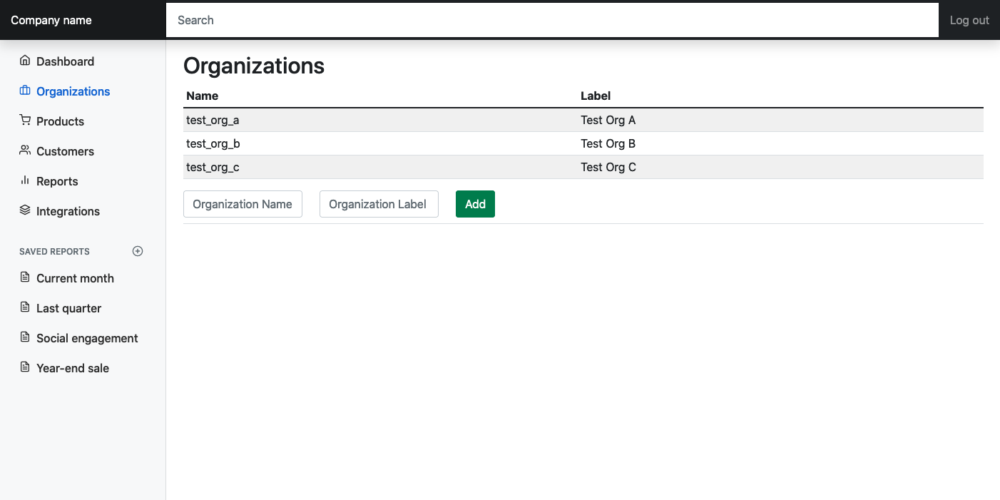

# gatsby-starter-typescript-auth0-hasura
##### A Gatsby starter in TypeScript for authenticating via Auth0 and using the JWT with Hasura over GraphQL

Although there are plenty of Gatsby+Hasura and Gatsby+Auth0 tutorials out there, at the time of writing all were out of date and using old patterns with deprecated libraries.

This starter provides a simple Gatsby Admin page that:

1. Authenticates via [Auth0 OAuth 2.0](https://auth0.com/docs/api/authentication) to obtain a [JSON Web Token](https://auth0.com/docs/secure/tokens/json-web-tokens) (JWT); and
1. Uses the JWT in the request header to make simple GraphQL query and mutation requests to [Hasura](https://hasura.io/).

The Admin page is styled with Bootstrap and is based on a slightly modified [Dashboard Component](https://getbootstrap.com/docs/5.2/examples/). "Organizations" are used as an example for listing and creating objects/records, all other nav links serve as display placeholders only.



This starter uses:

- [TypeScript](https://www.gatsbyjs.com/docs/how-to/custom-configuration/typescript/)
- [auth0-react](https://github.com/auth0/auth0-react) for Auth0 OAuth 2.0 authentication with JWTs
- [urgql](https://github.com/FormidableLabs/urql) for the GraphQL client
- [react-bootstrap](https://github.com/react-bootstrap/react-bootstrap) and [react-feather](https://github.com/feathericons/react-feather) for styling


### Hasura Configuration

1. Follow [instructions](https://hasura.io/docs/latest/graphql/core/getting-started/index/) to set up Hasura
1. Create a simple table to store Organizations
```sql
  CREATE TABLE organizations(
    id SERIAL PRIMARY KEY,
    name TEXT,
    label TEXT
  );
```
2. Track the table from the Hasura console *Data* tab
2. Add a few test records from the Hasura console *Data* > *Insert Row* tab
2. Allow your role (configured below) to `insert` and `select` from the Hasura console *Data* > *Permissions* tab


### Auth0 Configuration

Follow [these steps](https://hasura.io/docs/latest/graphql/core/guides/integrations/auth0-jwt/) to set up Auth0 with custom claims for Hasura.


### ENV configuration

Rename `.env.example` to `.env.development` and update accordingly

| Property                  | Example Value                                   |
| ------------------------- | ----------------------------------------------- |
| GATSBY_HASURA_GRAPHQL_URL | `http://localhost:8080/v1/graphql`         |
| GATSBY_AUTH0_DOMAIN       | `<my-tenant-name>.us.auth0.com`                 |
| GATSBY_AUTH0_CLIENT_ID    | `T4WN7SBfeJ0BO6CFX2nw3k2yEECHOVMe`              |
| GATSBY_AUTH0_REDIRECT_URI | `http://localhost:8000`                         |
| GATSBY_AUTH0_AUDIENCE     | `https://<my-tenant-name>.us.auth0.com/api/v2/` |


### Contribute

Please help us keep this starter up to date and adhering to best practices and conventions. We are not veterans in the space and appreciate any contributions or suggestions on how things can be done better. Feel free to submit an issue, pull request or reach out: *hello* at *whitebrick* dot *com*
